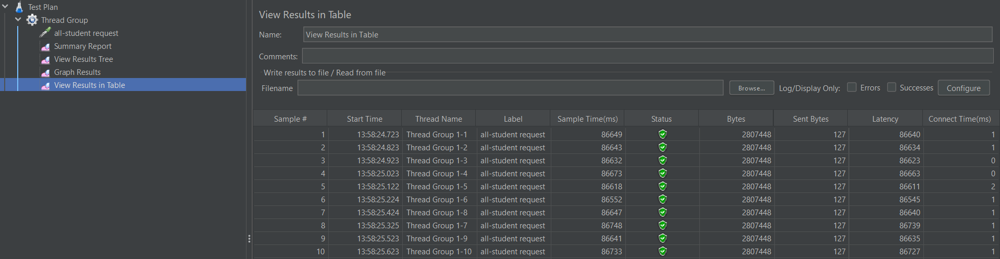
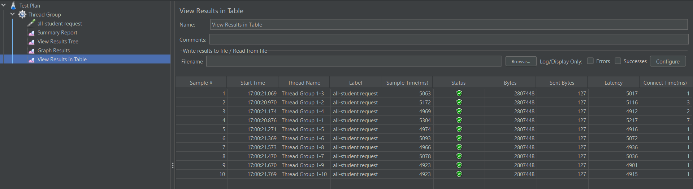
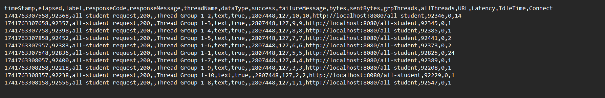
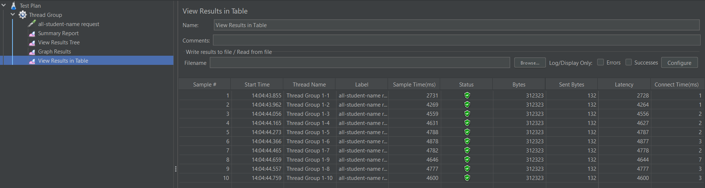
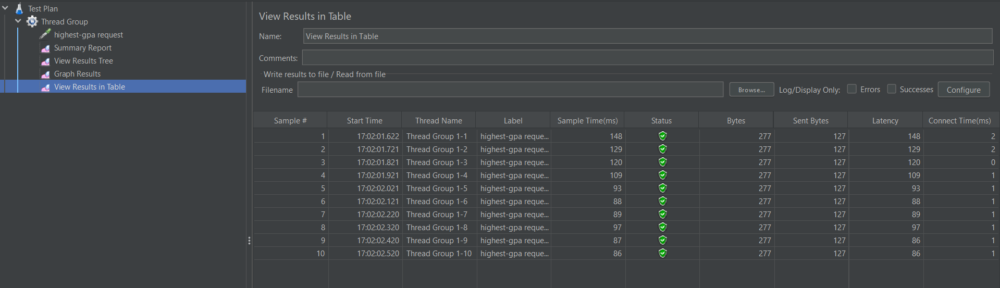
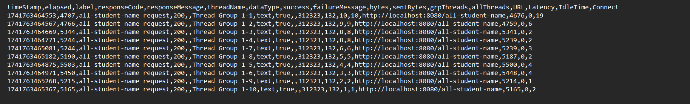
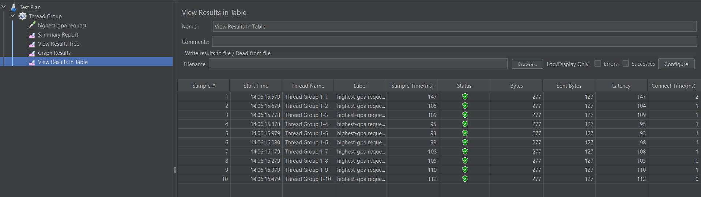
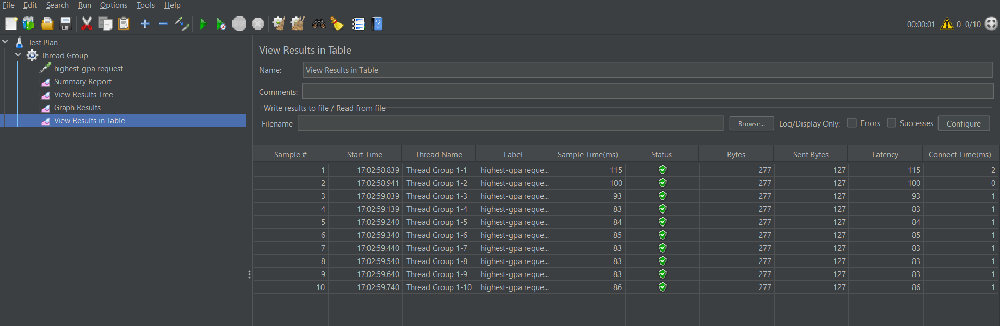
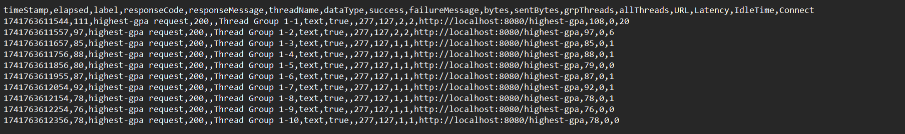

## Screenshots
### all-student

- before optimization

- after optimization

- log cli 

### all-student-name

- before optimization

- after optimization

- log cli 

### highest gpa

- before optimization

- after optimization

- log cli 

After implementing optimization to the queries, performance testing with JMeter shows an improvement of more than 20%. The optimization makes the code runs super fast and significantly reduce response times. 

## Reflection

> 1. What is the difference between the approach of performance testing with JMeter and profiling with IntelliJ Profiler in the context of optimizing application performance?

Performance testing with JMeter simulates load and measures performance of the application under a certain load, while profiling with IntelliJ Profiler dives into the code itself to see the application's behaviour to identify the culprit of performance issues. 

> 2. How does the profiling process help you in identifying and understanding the weak points in your application?

Profiling helps identify weak points by tracking execution times, memory usage, visualizing function calls, and pinpointing areas where resource usage is high, allowing for targeted code inspection.

> 3. Do you think IntelliJ Profiler is effective in assisting you to analyze and identify bottlenecks in your application code?

IntelliJ Profiler is effective due to its capability measuring resource usage throughout the application, exposes bottlenecks which consumes recources, easing optimization process.

> 4. What are the main challenges you face when conducting performance testing and profiling, and how do you overcome these challenges?

Performance testing and profiling could be tricky when mimicking a realistic simulation of real-world use with varying user behaviour. Inconsistency between the testing environment and the actual production environment can lead to misleading results. Utilizing the tools correctly helps simulate real-world scenarios and identify bottlenecks, leading to more reliable optimization decisions. 

> 5. What are the main benefits you gain from using IntelliJ Profiler for profiling your application code?

The profiler effectively monitors how resources are utilized throughout the application providing a comprehensive view of the code's performance. The profiler clearly identifies performance bottlenecks which might not be obvious through regular testing. It makes it easier to spot inefficient algorithms, methods, or routines that wouldn't be apparent from high-level performance tests.

> 6. How do you handle situations where the results from profiling with IntelliJ Profiler are not entirely consistent with findings from performance testing using JMeter?

Ensuring both tools run multiple times under similiar conditions to determine which results are consistently reproducible. Apply careful refactoring with small, measureable improvements. 

> 7. What strategies do you implement in optimizing application code after analyzing results from performance testing and profiling? How do you ensure the changes you make do not affect the application's functionality?

Focusing on bottlenecks identified by profilers that consume the most resources first, refactoring inneficient methods incrementally and measure the impact to validate improvements. Document the performance differences for each optimization. Run automated test suites to ensure the changes does not affect the application's functionality. 
